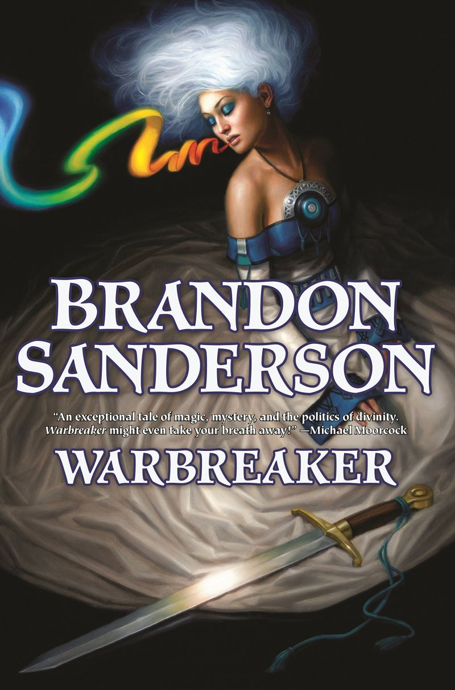

# Warbreaker

Brandon Sanderson has his book _Warbreaker_ available for free as an ebook on his [website](https://www.brandonsanderson.com/warbreaker-introduction/). For ease of reading and offline availability, I created a [PDF](./warbreaker_full.pdf) version of the book.

<p align="center">
  
</p>

## `webscraper.py`

This `Python 3.10.8` script uses `Selenium 4.8.0` to scrape the version of the book hosted on Brandon Sanderson's website.

This scraper generates `.tex` files in `output/` that converts the main text on each page from HTML to LaTeX.

For example, something like

```
<p>This is <i>some</i> text.</p>
```

is written to the output file as

```
This is \textit{some} text.
```

This conversion is also automatically done for chapter title, sections headers, and even the table and description list contained in the Ars Arcanum.

On top of generating `.tex` files for each chapter, this script also generates `warbreaker_full.tex`, which is the main `.tex` file which `\include`'s each of the chapters in order.

Brandon Sanderson also posted parallel annotations for each chapter in the book, but since I found it tedious to jump back and forth between the main text and the annotations, I have also appended all of the annotations to the end of each chapter.

 **WARNING:** Some of the annotations do contain spoilers, all text that is in red is a spoiler. 

## `final/`

The purpose of `webscraper.py` was not to create a finished product, merely to do the majority of the work for me (rather than copying the plain text and doing all of the formattin by hand).

After running `webscraper.py`, I copied all the files from `output/` to `final/` and used a combination of `vim` magic and a small amount of manual work to finalize the typesetting.

Finally, I created `warbreaker.sty` in order to define stylistic parameters for the document.

## License & rights

As outlined by Brandon Sanderson, his book is protected under a [Creative Commons Attribution-Noncommercial-No Derivative Works 3.0 United States License](https://www.brandonsanderson.com/warbreaker-rights-explanation/).

In compliance with that license, I have not modified the text of the book in any way, merely typeset it. **This is not my writing, I am not the author of this book.**

If you notice any mistakes that **I** have made in converting the book into a PDF or any inconsistencies between the PDF and the online version of the book, please let me know!

